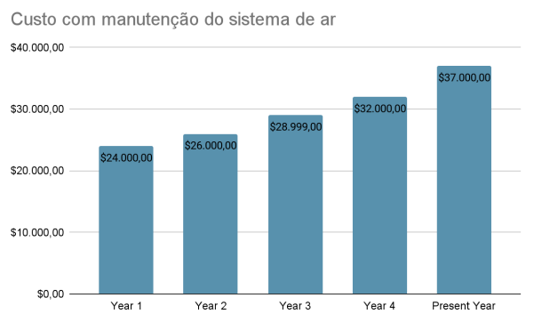

# Otimização do planejamento da manutenção de sistemas de ar de caminhões

Uma empresa terceirizada de transporte de caminhões viu a necessidade de otimizar seus 
gastos com a manutenção do sistema de ar de seus veículos. Apesar de a frota ter mantido a 
média de caminhões constante, nos últimos anos, os gastos com esse problema aumentaram 
constantemente, chegando a R$37.000,00 no ano atual.

Quanto aos custos de manutenção para os sistemas de ar dos caminhões, se destacam as três modalidades:
* R$10 para revisões **preventivas** nas quais não é encontrado nenhum problema;
* R$25 para revisões **preventivas** nas quais é identificado um problema no sistema de ar e que necessita de manutenção;
* R$500 para manutenções **corretivas** no sistema de ar, quando o veículo não passou por uma revisão preventiva,
incluindo custos de peças, mão de obra, etc.

Espera-se que com utilização de modelos preditivos seja possível reduzir
os custos com as manutenções em geral dos sistemas de ar, principalmente antecipando a revisão de veículos
que já estejam com algum problema em seu sistema de ar e necessite de uma vistoria preventiva, evitando que o 
número de veículos que requerem manutenções corretivas seja excessivo.

A análise completa desse problema pode ser encontrada no link abaixo:

[Análise de Otimização](./analise/)

## Questões levantadas sobre o projeto

Questionamentos pertinentes sobre a implementação de técnicas de ciência de dados 
sempre são levantadas em diversos projetos, e com esse não é diferente. Cada projeto tem 
suas necessidades e sua própria identidade quanto ao que deve ser feito. A seguir algumas 
questões sobre a elaboração e desenvolvimento serão respondidas, a fim de tornar o processo 
analítico dessa análise mais compreensível e replicável.

 1. *Quais passos você realizaria para solucionar este problema? Por favor
descreva da forma mais completa e clara possível todos os passos que
você enxerga como essenciais para a resolução do problema.*

Como o problema já foi desenvolvido, é possível descrever os passos que foram necessários no desenvolvimento do mesmo:
* Entender o projeto como um todo: O projeto lida com um gasto com manutenção de sistema de ar de veículos que sucessivamente, ano após ano, vem aumentando. Sabendo os custos de cada nível manutenção, é possível inferir que o momento necessário para a realização de uma revisão preventiva não tem sido alvo de atenção, já que cada uma das manutenções corretivas custa $500;
* Explorar os dados para ganhar insights: Como o dataset disponibilizado possui os registros de casos positivos e negativo de manutenção do sistema de ar, saber como a proporção de veículos de distribui é essencial para estabelecer o cálculo aproximado de quanto dos $37000 corresponde aos veículos que realizaram manutenção corretiva. Como o objetivo principal é reduzir o número dessas manutenções, ter esse número em mãos é fundamental;
* Preparação, limpeza e transformação dos dados para melhor entendimento de sua distribuição: Explorar a tabela em si, sua dimensionalidade (que nesse caso é bem robusta), os datatypes de cada uma das colunas, split entre os sets de treino e teste...Todas essas etapas geram ideias para como implementar o modelo da melhor maneira além de visar salvar o uso excessivo de recursos computacionais;
* Modelos, Treinamento e fine-tuning dos hyperparâmetros: A parte mais trabalhosa se é bem trabalhada é essa. A dinâmica e a escolha de modelos e parâmetros avaliados irão indicar a escolha ideal para o modelo final. Como é um projeto de classificação que visa reduzir a quantidade de veículos que necessitam de manutenção corretiva, as métricas de avaliação do modelo precisam ser pensadas para se adequar a essas necessidades;
* Aplicação do modelo no test set: A parte que define o sucesso no desenvolvimento do projeto, no qual o modelo é aplicado na tabela de teste, retornando as métricas que indicam que o projeto ocorreu da maneira correta, podendo assim também comparar valores que seriam gastos numa situação comum e os valores que poderiam ser gastos com a implementação do modelo.

